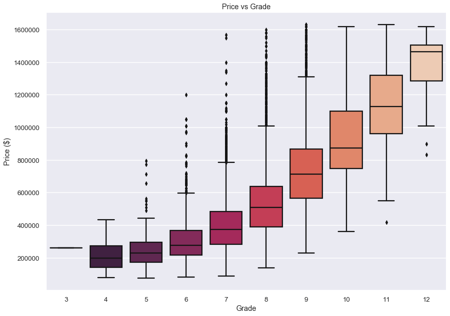
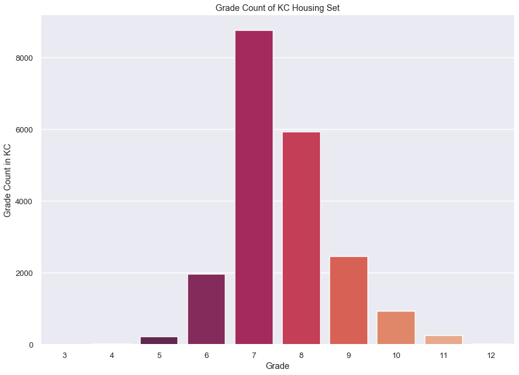
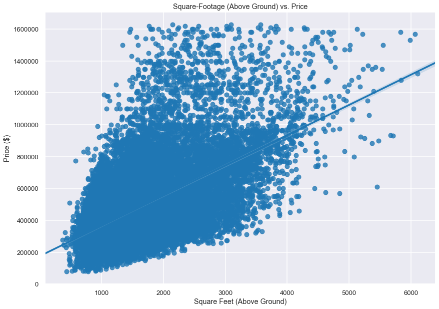
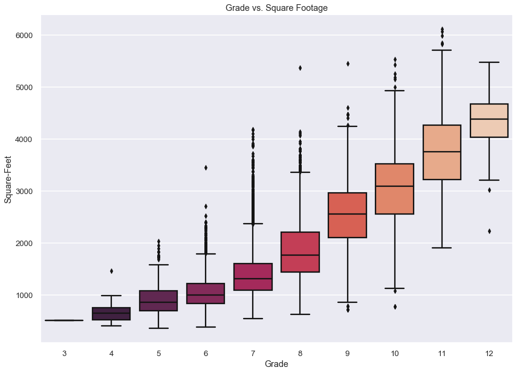
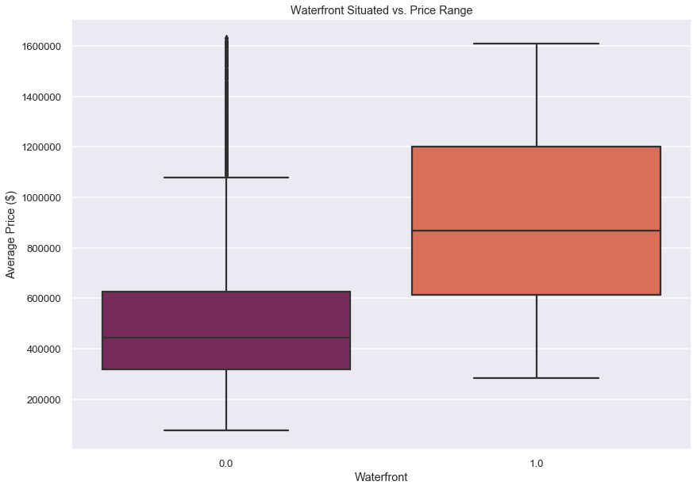

# Project Introduction/Goal

For my Module 2 final project, I was tasked with cleaning up a housing data set for King County in Washington and performing a multiple linear regression analysis on the data. The aim was to build a model that successfully predicts the price of a house using features from our data set, using adjusted R-Squared as our metric. My deliverables will be a working machine learning model to predict price and a non-technicaly slideshow presentation of my findings, conclusions and recommendations.

# Libraries used in this project
* Pandas
* NumPy
* Matplotlib
* Seaborn
* sklearn
* SciPy
* statsmodels

# Methods 
## (based on OSEMN framework)

* Obtain data and import necessary libraries
* Scrub: Cleaning our data
    * dealing with missing values
        * Assigning 0 to null 'waterfront' values
        * Dropping rows with missing 'view values'
        * Assigning median value to 'yr_renovated'
    * Removing outliers from 3 standard deviations from the mean in certain columns
    * Assigning median to placeholder values in'sqft-basement'
    * Dropping instances of resold homes (duplicate sales)
    * Assesing multicollinearity
    * Dealing with categorical variables
        * One-hot encoding 
    * Log-transform continuous variables
* EDA
    * Exploring various potential relationships between selected features and sale price
        * Bedrooms
        * Bathrooms
        * sq-footage
* Train-Test Split and Baseline Model
* Model tuning and refinement for highest adjusted R-squared
* Cross Validation
* Conclusions
* Visualizations to support findings.

## Checking for Initial multicollinearity

An initial glance at the correlation heatmap above shows that some variable pairs that stand out with considerable correlation, which is denoted by the darker values of red and blue.

Let's utilize a function that returns a dataframe of pairs that are highly correlated (> 0.75).

Dropping sqft-living.

The remaining collinear variables, sqft_above & grade, we will keep for now, as their variables represent two entirely different measurements, area and condition.

## Dealing with Categorical Variables

In order to create a multiple linear regression model later, we are going to need to one-hot-encode (create dummy variables of) these categorical variables, and bin some of them as well.

### 'bedrooms'

Binning bedrooms. 

### 'bathrooms'

Binning bathrooms
### 'floors'

### 'waterfront'

Since waterfront is already a binary category, we won't need to one-hot encode this.

### 'view'

### 'condition'

###  'grade'

### 'yr_renovated'

Convert to binary column.

### 'zipcode'

We are assigning the divided latitude and longitude into 4 sectors, 1, 2, 3, & 4.

One-hot encoding our sector column.

### 'sqft_basement'

Turn into binary category.

## Dealing with Continuous Variables

### Log-Transformations

Log transforming continuous variables.

# Explore the Data

## How many bedrooms do the highest priced houses have on average? Which amount of bedrooms sell the most?

Graphing bedrooms to price.

Graphing summarized count of bedrooms in the housing set.

### Do bedrooms have a linear relation to price?

Checking linearity to price.

## How many bathrooms do the highest priced houses have on average? Which amount of bathrooms sell the most?

Graphing bathrooms to price.

Graphing summarized count of bathrooms in the housing set.

### Do bathrooms have a linear relationship to sale price?

Checking linearity to price.

## Does square-footage have any relation to price?

Checking linearity to price.

# Initial Test/Train Split

    Train Mean Squarred Error: 38940886676.30909
    Test Mean Squarred Error: 42922141011.85304

    Train Root Mean Squarred Error: 197334.45385007933
    Test Root Mean Squarred Error: 207176.59378378882

# Baseline Model & Refinement

## Dropping outliers for the model

## Cleaning p-values of over 0.05

No remaining variables with high p-values now. 
The 3 strongest positive coefficients are:

grade_9_13	301577.3742

waterfront  212760.8886

log_sqft_above	211544.1564

# Post-Model Test/Train Split

    Train Mean Squarred Error: 19347510916.9707
    Test Mean Squarred Error: 18513014118.52777

    Train Root Mean Squarred Error: 139095.3303205061
    Test Root Mean Squarred Error: 136062.5375278874

Our RMSE is much lower now, by 60,000. The Train and Test RSMEs are close to each other which is good.
For every change in X, our Y (Price) will fluctuate about 136,000.

# Cross-Validation
10-fold cross validation of our test/train split. 

# Conclusions

Our multiple linear regression model is not so bad with an end adjusted r-squared value of .711. Our Train and Test Root Mean Squared Error are decent at 136,000. This means that for every unit change in y, our target variable, price, will adjust 136,000 dollars. 

In our final model, the 3 strongest predictor of price were: sqft-above (the square footage of the home, not including the basement), grade (the overall grade given to the housing unit, based on King County grading system), and waterfront (whether or not the property is situated on the water).

One of our initial EDA hypotheses was not so correct. Bedrooms don't tend to predict the price of a home so well, which is due to high variation in homes.

Even with outliers removed, however, some variance is still prominent in the high price ranges as seen in out qqplot. Further analysis is recommended. More specific exploration into further adjusting features can potentially strengthen the normality of the models predictions in the upper price range.

# Visualizations of Strongest Predictors
## Grade vs Price

## Sqft-Above vs. Price

Here we can see there is potential for picking a good candidate for renovation. Some houses with lower grades (lower prices) do share the amount of square footage as homes with higher grades. Considering such, a good pick would be a lower grade home (5-6) and renovating it, thereby increasing the grade hopefully (7-10) and subsequent price, without altering the square-footage.

## Waterfront

